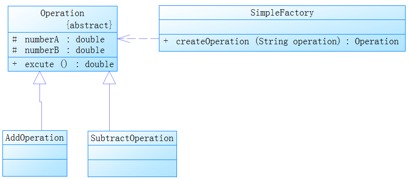

# 简单工厂模式

### 1. 示例

计算器进行加减乘除等运算操作，利用简单工厂获取运算操作类。

### 2. UML图

### 3. 简单工厂模式

也称静态工厂模式，但不属于GOF的23种设计模式之一，属于类创建型模式。可以根据参数的不同返回不同类的实例，通常这些类都有一个共同的接口。

#### 优点

解耦，客户端只需从工厂获取自己需要的实例，而不需要关注其实例的创建过程。

#### 缺点

简单工厂类中集中了所有实例的创建逻辑，这将导致如果工厂类出现问题，所有客户端都受到影响。此外，违背了“开闭原则”，当需要新增产品时，就需要在简单工厂类中加入相应的建造实例的逻辑。

