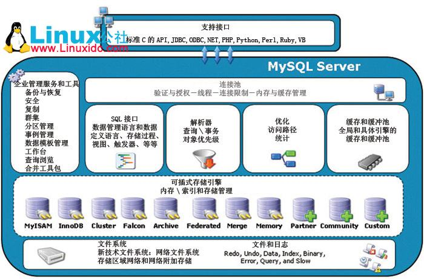
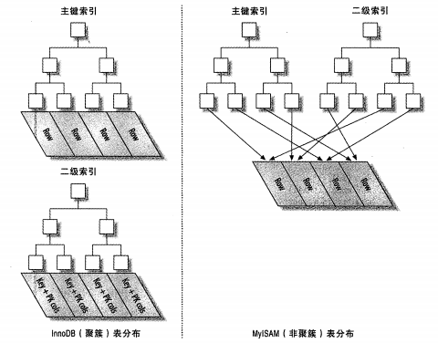

> 谈到索引，这个词对于多数使用过数据库的人来说都不陌生，若是要你谈谈索引是什么？有什么结构？在mysql有什么分类？覆盖索引是什么？或许有不少人也能答得出来。但笔者接着问，怎么进行索引优化分析？explain主要看哪些字段？索引失效的场景有哪些？如何合理的使用索引？猜测不少人就答不上来了吧，以上问题将分两篇文章详细阐述。

# 一、mysql架构

要认清mysql的索引，首先需要认识mysql的架构。

### 1. Mysql逻辑架构介绍



从上图可以看到，mysql内部逻辑结构分成四层，分别是连接层、服务层、引擎层、存储层，这种分层方式有点类似于JavaWeb开发中的controller-service-dao，这样分层都是为了明确职责，易于解耦。

下面是各层的用途说明。

1. 连接层

   最上层是一些客户端和连接服务，包含本地sock通信和大多数基于客户端/服务端工具实现的类似于tcp/ip的通信。主要完成一些类似于连接处理、授权认证、及相关的安全方案。在该层上引入了线程池的概念，为通过认证安全接入的客户端提供线程。同样在该层上可以实现基于SSL的安全链接。服务器也会为安全接入的每个客户端验证它所具有的操作权限。

2. 服务层

   2.1  Management Serveices & Utilities： 系统管理和控制工具  
   2.2  SQL Interface: SQL接口接受用户的SQL命令，并且返回查询结果。比如select from就是调用SQL Interface。
   2.3 Parser: 解析器：SQL命令传递到解析器的时候会被解析器验证和解析。 
   2.4 Optimizer: 查询优化器：SQL语句在查询之前会对查询进行优化。 
        用一个例子就可以理解： select uid,name from user where  gender= 1;
        优化器来决定先投影还是先过滤。

   2.5 Cache和Buffer： 查询缓存。
         如果查询缓存有命中的查询结果，查询语句就可以直接去查询缓存中取数据。
         这个缓存机制是由一系列小缓存组成的。比如表缓存，记录缓存，key缓存，权限缓存等
          缓存是负责读，缓冲负责写。

3. 引擎层

   存储引擎层，存储引擎真正的负责了MySQL中数据的存储和提取，服务器通过API与存储引擎进行通信。

   由图可看到，Mysql有多种存储引擎，它之所以在多种不同场景中应用并发挥良好作用就主要体现在存储引擎的架构上。

   **插件式的存储引擎架构将查询处理和其它的系统任务以及数据的存储提取相分离。**这种架构可以根据业务的需求和实际需要选择合适的存储引擎。

4. 存储层

   主要是将数据存储在运行于裸设备的文件系统之上，并完成与存储引擎的交互。

### 2. Mysql存储引擎

关于存储引擎这块，主要认识的是**InnoDB**和**MyISAM**。

1、InnoDB存储引擎
InnoDB是MySQL的默认事务型引擎，它被设计用来处理大量的短期(short-lived)事务。除非有非常特别的原因需要使用其他的存储引擎，否则应该优先考虑InnoDB引擎。行级锁，适合高并发情况

2、MyISAM存储引擎
MyISAM提供了大量的特性，包括全文索引、压缩、空间函数(GIS)等，但MyISAM不支持事务和行级锁(myisam改表时会将整个表全锁住)，有一个毫无疑问的缺陷就是崩溃后无法安全恢复。


# 二、索引简介

### 1. 是什么

> 官方定义：索引（Index）是帮助MySQL高效获取数据的数据结构。
>
> 数据本身之外，数据库还维护着一个满足特定查找算法的数据结构，这些数据结构以某种方式指向数据，这样就可以在这些数据结构的基础上实现高级查找算法，这种数据结构就是索引。

以上，可理解为：**索引是排序好的快速查找的数据结构**。

### 2. 索引结构

通常，数据库的索引一般值B-Tree索引，Mysql中InnoDB引擎与MyISAM引擎具体实现都是采用B+Tree算法。

1. B-Tree索引

   

   【假设】 
   一颗b树，浅蓝色的块我们称之为一个磁盘块，可以看到每个磁盘块包含几个数据项（深蓝色所示）和指针（黄色所示），
   如磁盘块1包含数据项17和35，包含指针P1、P2、P3，
   P1表示小于17的磁盘块，P2表示在17和35之间的磁盘块，P3表示大于35的磁盘块。
   真实的数据存在于叶子节点
   即3、5、9、10、13、15、28、29、36、60、75、79、90、99。
   非叶子节点不存储真实的数据，只存储指引搜索方向的数据项，如17、35并不真实存在于数据表中。

   【查找过程】
   如果要查找数据项29，那么首先会把磁盘块1由磁盘加载到内存，此时发生一次IO，在内存中用二分查找确定29在17和35之间，锁定磁盘块1的P2指针，内存时间因为非常短（相比磁盘的IO）可以忽略不计，通过磁盘块1的P2指针的磁盘地址把磁盘块3由磁盘加载到内存，发生第二次IO，29在26和30之间，锁定磁盘块3的P2指针，通过指针加载磁盘块8到内存，发生第三次IO，同时内存中做二分查找找到29，结束查询，总计三次IO。

   真实的情况是，3层的b+树可以表示上百万的数据，如果上百万的数据查找只需要三次IO，性能提高将是巨大的，如果没有索引，每个数据项都要发生一次IO，那么总共需要百万次的IO，显然成本非常非常高。

   ​

2. B+Tree索引

   B+Tree的结构和B-Tree类似，不过它的非叶子结点只包含导航信息，不包含实际的值，所有的叶子结点使用链表相连，便于区间查找和遍历。

   **思考：为什么说B+树比B树更适合实际应用中操作系统的文件索引和数据库索引？** 
   1) B+树的磁盘读写代价更低 
   　　B+树的内部结点并没有指向关键字具体信息的指针。因此其内部结点相对B树更小。如果把所有同一内部结点的关键字存放在同一盘块中，那么盘块所能容纳的关键字数量也越多。一次性读入内存中的需要查找的关键字也就越多。相对来说IO读写次数也就降低了。 
   2) B+树的查询效率更加稳定 
   　　由于非终结点并不是最终指向文件内容的结点，而只是叶子结点中关键字的索引。所以任何关键字的查找必须走一条从根结点到叶子结点的路。所有关键字查询的路径长度相同，导致每一个数据的查询效率相当。

   ​

3. Hash索引

   对于每一行记录，存储引擎会对所有的索引列计算一个哈希码，哈希索引将所有哈希码存储在索引中，同时在哈希表中保存指向每个数据行的指针。
   哈希索引只包含哈希值和行指针，而不存储字段值。
   哈希索引无法用于排序，因为不是根据索引值顺序存储的。
   哈希索引不支持部分索引列匹配查找，因为是使用所有索引列来计算哈希值的。

   ​

4. 聚簇索引与非聚簇索引

   聚簇索引并不是一种单独的索引类型，而是一种数据存储方式。Mysql中InnoDB引擎采用的就是聚簇索引来存储数据。

   如下图，左侧的索引就是聚簇索引，**因为数据行在磁盘的排列和索引排序保持一致**。

   

   聚簇索引的好处：
   按照聚簇索引排列顺序，查询显示一定范围数据的时候，由于数据都是紧密相连，数据库不用从多个数据块中提取数据，所以节省了大量的io操作。

   **注意**：

   Mysql中InnoDB引擎主键支持聚簇索引，正如上图右侧所示，InnoDB引擎中二级索引存储的数据是主键，需要通过二级索引定位到主键，在通过聚簇索引找到数据。

   为了充分利用聚簇索引的聚簇的特性，所以innodb表的主键列尽量选用有序的顺序id，而**不建议用无序的id，比如uuid**这种。有人会说，不用uuid我分布式怎么保证全局唯一id，请参考 `snowflake`。

   ​

5. full-text全文索引

   这里需要记住的是：**Mysql 5.7以后InnoDB已经支持full-text，不要再傻乎乎的说不行。

### 3. 索引分类

1. 主键索引

   设立为主键后自动建立索引，innodb为聚簇索引。列值必须唯一，不允许有空值。

   ​

2. 唯一索引

   索引列的值必须唯一，但允许有空值。

   ​

3. 单值索引

   最普通的索引，即一个索引只包含单个列，一个表可以有多个单值索引。

   ​

4. 复合索引

   即一个索引包含多个列。

   ​

5. 语法

   ```sql
   # 创建
   ALTER table_name ADD  [UNIQUE ]  INDEX [indexName] ON (columnname(length));

   CREATE [UNIQUE] INDEX idx_name ON table_name (columnname(length));

   # 删除
   DROP INDEX [indexName] ON mytable;

   # 查看
   SELECT INDEX ON table_name\G
   ```

### 4. 优与劣

1. 优势

   类似大学图书馆建书目索引，提高数据检索的效率，降低数据库的IO成本。

   通过索引列对数据进行排序，降低数据排序的成本，降低了CPU的消耗。

   ​

2. 缺点

   实际上索引也是一张表，该表保存了主键与索引字段，并指向实体表的记录，所以索引列也是要占用空间的。

   虽然索引大大提高了查询速度，同时却会降低更新表的速度，如对表进行INSERT、UPDATE和DELETE。因为更新表时，MySQL不仅要保存数据，还要保存一下索引文件每次更新添加了索引列的字段，都会调整因为更新所带来的键值变化后的索引信息。

### 5. 使用场景

不需要建立索引：

1. 表记录太少（比如小于一百万）

2. 经常增删改的表。因为还需要额外维护索引文件。

3. 索引选择性低的字段，即数据重复且分布平均的表字段。

   索引的选择性是指索引列中不同值的数目与表中总记录数的比。一个索引的选择性越接近1，这个索引的效率就越高。

   这里举两个例子说明一下。

   假如一个表有10万行记录，有一个字段A只有T和F两种值，且每个值的分布概率大约为0.5，这时索引的选择性是2/100000=0.00002，那么对该表的字段A建索引一般不会提高数据库的查询速度。

   再假如如果一个表中2000条记录，表索引列有1980个不同的值，表索引列有1980/2000=0.99，可以建立索引。

需要建立索引：

1. 主键自动建立主键索引

2. 频繁作为查询条件的字段应该创建索引(where 后面的语句)

3. 查询中与其它表关联的字段，外键关系建立索引。

   A 表关联 B 表： on 后面的连接条件,即A 表查询 B 表的条件。

   所以 B 表被关联的字段建立索引能大大提高查询效率。

4. 单值/复合索引的选择问题，在高并发下倾向创建复合索引。

5. 查询中排序的字段，排序字段若通过索引去访问将大大提高排序速度。

6. 查询中统计或者分组字段

# 三、性能分析

### 1. Mysql常见瓶颈

一般来说，数据库常见瓶颈在于CPU、IO和锁。

| 数据库瓶颈 | 解释                                                        |
| ---------- | ----------------------------------------------------------- |
| CPU        | SQL中对大量数据进行比较、关联、排序、分组                   |
| IO         | 实例内存满足不了缓存数据或排序等需要，导致产生大量物理 IO。 |
|            | 查询执行效率低，扫描过多数据行。                            |
| 锁         | 不适宜的锁的设置，导致线程阻塞，性能下降。                  |
|            | 死锁，线程之间交叉调用资源，导致死锁，程序卡住。            |

### 2. Explain

针对上述的瓶颈，我们需要对慢SQL进行分析，这里就引出了接下来要讲 ` Explain` 关键字。

1. 是什么

   使用EXPLAIN关键字可以模拟优化器执行SQL查询语句，从而知道MySQL是如何处理你的SQL语句的。分析你的查询语句或是表结构的性能瓶颈。

   更清晰的介绍可看官网：http://dev.mysql.com/doc/refman/5.5/en/explain-output.html

   ​

2. 有啥用

   可以清楚查询语句中：

   + 表的读取顺序
   + 表之间的引用
   + 数据读取操作的操作类型
   + 哪些索引可以使用
   + 哪些索引被实际使用
   + 每张表有多少行被优化器查询

   ​

3. 怎么用

   语法

   ```sql
   explain SQL;
   explain SQL\G
   ```

   示例

   ```sql
   explain select * from user;
   ```

   ​

4. 各字段解释

   

   | 字段（*表示很重要） | 解释                                                         |
   | ------------------- | ------------------------------------------------------------ |
   | *id                 | select查询的序列号,包含一组数字，表示查询中执行select子句或操作表的顺序。id越大，查询的优先级越高。id相同，则从上往下依次执行。 |
   | select_type         | 查询的类型，主要是用于区别普通查询、联合查询、子查询等的复杂查询。SIMPLE、PRIMARY、SUBQUERY、DERIVED、DEPENDENT SUBQUERY、UNION、UNION RESULT、UNCACHEABLE SUBQUREY |
   | table               | 显示这一行的数据是关于哪张表的                               |
   | *type               | 访问类型排列，结果值从最好到最坏依次是：system > const > eq_ref > ref > range > index > all，一般来说，得保证查询至少达到range级别，最好能达到ref。 |
   | possible_keys       | 显示可能应用在这张表中的索引，一个或多个。查询涉及到的字段上若存在索引，则该索引将被列出 |
   | *key                | 实际使用的索引。如果为NULL，则没有使用索引。                 |
   | key_len             | 表示索引中使用的字节数，可通过该列计算查询中使用的索引的长度。 |
   | ref                 | 显示索引的哪一列被使用了，如果可能的话，是一个常数。哪些列或常量被用于查找索引列上的值 |
   | *rows               | rows列显示MySQL认为它执行查询时必须检查的行数。              |
   | *Extra              | 包含不适合在其他列中显示但十分重要的额外信息。比如出现：using filesort、using temporary，一定需要避免。出现using index说明使用到了覆盖索引。 |
   |                     |
### 3. 使用索引

1. 全值匹配

   完全匹配索引。

   ​

2. 最左前缀原则

   复合索引需要遵循最左前缀原则，查询时从索引的最左列开始，并且`不跳过`索引中的列。 **and 忽略左右关系。既即使没有没有按顺序 由于优化器的存在，会自动优化。**（不跳过指查询条件中存在）

   ​

3. 不在索引列上做任何操作

   计算、函数、(自动or手动)类型转换，会导致索引失效而转向全表扫描。

   再比如**字符串不加单引号索引失效**，从这里必须意识到需要避免隐式类型转换，底层会调用函数进行转化从而导致索引失效。

   ​

4. 存储引擎不能使用索引中<u>范围条件右边</u>的列

   若有索引则能使用到索引，范围条件右边的索引会失效(范围条件右边与范围条件使用的同一个组合索引，右边的才会失效。若是不同索引则不会失效)。

   ​

5. 尽量使用覆盖索引

   只访问索引的查询(索引列和查询列一致)，减少select *

   ​

6. mysql 在使用不等于(!= 或者<>)的时候无法使用索引会导致全表扫描

   ​

7. is not null 也无法使用索引,但是is null是可以使用索引的

   ​

8. like以通配符开头('%abc...')mysql索引失效会变成全表扫描的操作

   like ‘%abc%’  type 类型会变成 all
   like ‘abc%’ type 类型为 range ，算是范围，可以使用索引

   问题：解决like '%字符串%'时索引不被使用的方法？

   覆盖索引，在需要查询的字段上面建立索引。

   ​

9. 少用or,用它来连接时会索引失效

   ​

10. 建议：

   对于单键索引，尽量选择针对当前query过滤性更好的索引。

   在选择组合索引的时候，当前Query中过滤性最好的字段在索引字段顺序中，位置越靠前越好。(避免索引过滤性好的索引失效)

   在选择组合索引的时候，尽量选择可以能够包含当前query中的where字句中更多字段的索引。

   尽可能通过分析统计信息和调整query的写法来达到选择合适索引的目的。

   ​